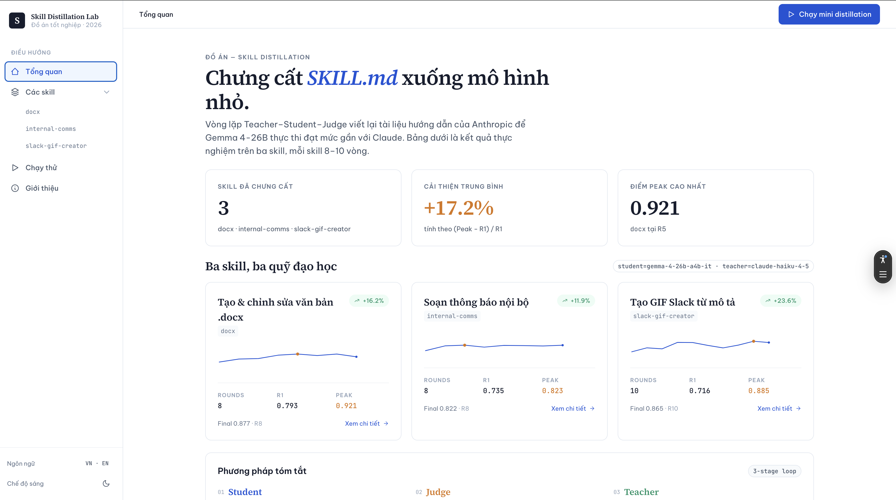
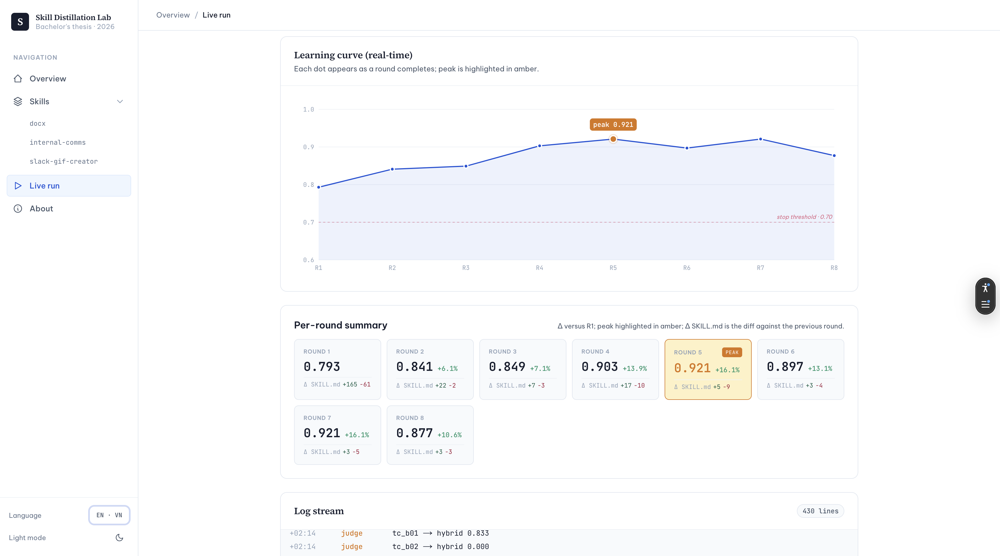
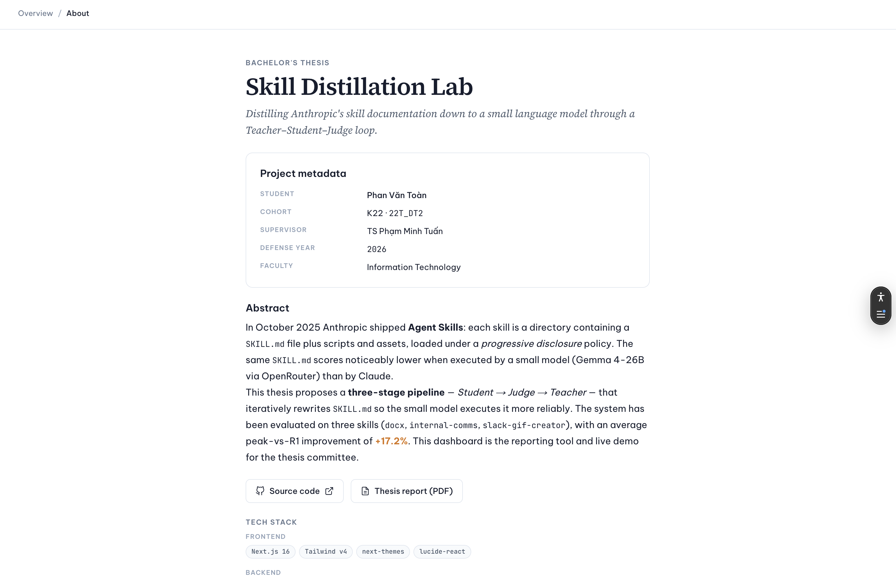

# Skill Distillation

[](https://github.com/givoxxs/Skills_Distillation/actions/workflows/ci.yml)
[](LICENSE)
[](https://www.python.org/downloads/release/python-3120/)
[](https://skills-distillation.vercel.app)

> Chưng cất tài liệu `SKILL.md` của Anthropic xuống mô hình ngôn ngữ nhỏ — không huấn luyện lại trọng số, chỉ viết lại văn bản hướng dẫn qua vòng lặp *Teacher → Student → Judge*.

**Đồ án tốt nghiệp 2026** · Phan Văn Toàn · K22 · `22T_DT2` · GVHD TS. Phạm Minh Tuấn · Khoa Công nghệ Thông tin.

🔗 **Live demo:** <https://skills-distillation.vercel.app>



---

## Tại sao

Tháng 10 / 2025 Anthropic công bố [Agent Skills](https://www.anthropic.com/engineering/equipping-agents-for-the-real-world-with-agent-skills) — mỗi skill là một thư mục `SKILL.md` + scripts + assets, được mô hình nạp theo *progressive disclosure*. Cùng một `SKILL.md` khi chạy trên mô hình nhỏ (Gemma 4-26B qua OpenRouter) đạt điểm thấp hơn rõ rệt so với Claude.

Đề tài đặt câu hỏi: **có thể viết lại `SKILL.md` — vẫn ở mức ngôn ngữ tự nhiên, không can thiệp trọng số — sao cho mô hình nhỏ thực thi đáng tin cậy hơn không?**

Và quy trình đó *tự động hoá* được không?

---

## Pipeline `distillation_v2`

```
              ┌─────────────────────────┐
              │   SKILL.md (vòng N)     │
              └────────────┬────────────┘
                           │
              ┌────────────▼────────────┐
              │  STAGE 1  ·  STUDENT    │   Gemma 4-26B (OpenRouter)
              │  Chạy mỗi test case     │   ──── 12 test cases / vòng
              └────────────┬────────────┘
                           │
              ┌────────────▼────────────┐
              │  STAGE 2  ·  JUDGE      │   Claude Haiku 4.5
              │  Rule check + LLM judge │   ──── hybrid score
              └────────────┬────────────┘
                           │
              ┌────────────▼────────────┐
              │  STAGE 3  ·  TEACHER    │   Claude Haiku 4.5
              │  Viết lại SKILL.md      │   ──── Gate 1 + Gate 2 rollback
              └────────────┬────────────┘
                           │
              ┌────────────▼────────────┐
              │   SKILL.md (vòng N+1)   │
              └─────────────────────────┘
```

**Điều kiện dừng** (bất kỳ điều nào): `score ≥ 0.70` · hội tụ Δ < 0.02 qua 3 vòng · chạm `max_rounds = 10`.

---

## Kết quả thực nghiệm

Pipeline đã chạy đầy đủ trên ba skill từ repo `anthropics/skills`:

| Skill | Số vòng | R1 | Đỉnh (vòng) | Cuối | Δ R1 → Peak |
|---|---|---|---|---|---|
| **`docx`** | 8 | `0.793` | **`0.921`** (R5) | `0.877` | **+16.2 %** |
| **`internal-comms`** | 8 | `0.735` | **`0.823`** (R3) | `0.822` | **+11.9 %** |
| **`slack-gif-creator`** | 10 | `0.716` | **`0.886`** (R9) | `0.865` | **+23.6 %** |

Cả ba skill đều vượt ngưỡng dừng `0.70` ngay từ vòng 1; pipeline tiếp tục chạy để tìm đỉnh. Quan sát thực nghiệm: **mọi skill đều có vòng đỉnh rồi suy giảm nhẹ ở vòng cuối** — gợi ý hiện tượng *over-fit rubric ở vòng muộn*, chưa được hình thức hoá trong literature *automatic prompt optimization* hiện có.

> Số liệu đầy đủ trong `distillation_v2/results/stable/<skill>/summary.json` — đường học, chi tiết test case, các phiên bản `SKILL_round_*.md` đều có sẵn.

---

## Mô hình & stack

| Vai trò | Mô hình | Truy cập |
|---|---|---|
| Student | `google/gemma-4-26b-a4b-it` | OpenRouter |
| Teacher | `anthropic/claude-haiku-4-5` | Anthropic API |
| Judge | `anthropic/claude-haiku-4-5` (ensemble) | Anthropic API |

**Stack:** Python 3.12 (conda env `skills`) · Anthropic SDK · OpenRouter · Click + Rich · PyYAML · pytest · pre-commit.

**Demo app:** Next.js 16 App Router + Tailwind v4 + FastAPI + SSE (xem `demo-app/`).

---

## Demo

| Trang | Ảnh |
|---|---|
| Overview — 3 KPI + sparkline per skill |  |
| Skill detail — learning curve + diff `SKILL.md` round-by-round |  |
| Live run — SSE replay 8–10 rounds với batch 5 song song |  |
| About |  |

> *Capture instructions:* xem `docs/screenshots/README.md`.

---

## Bắt đầu nhanh

### Yêu cầu

- **Conda env `skills`** (Python 3.12) — `.claude/rules/python-env.md` giải thích vì sao project gắn cứng vào env này.
- Node 20+ và pnpm (chỉ cho demo app).
- `.env` ở repo root với `OPENROUTER_API_KEY` + `ANTHROPIC_KEY`.

### Pipeline distillation

```bash
cd distillation_v2

# Chạy 3 vòng với 5 test case (debug)
python run.py --skill docx --rounds 3 --test-cases 5 --verbose

# Chạy đầy đủ tới max_rounds, resume nếu đã có batch cũ
python run.py --skill docx
```

Output rơi vào `distillation_v2/results/<ngày>/<run_id>/`. Kết quả "ổn định để báo cáo" được sao chép thủ công sang `distillation_v2/results/stable/<skill>/`.

### Demo dashboard

```bash
cd demo-app
make install      # cài frontend (deps backend đã có trong conda env)
make dev          # backend :8000 + frontend :3000
```

Mở `http://localhost:3000`. Xem `demo-app/README.md` cho chi tiết.

### Tests

```bash
# Toàn bộ suite (demo-app + distillation_v2)
pytest

# Chia ra
cd demo-app && make test-backend     # 23 tests FastAPI
cd demo-app && make test-pipeline    # tests pipeline distillation_v2
```

---

## Cấu trúc thư mục

```
skill_distillation/
├── distillation_v2/                ← Pipeline chính (đang dùng cho đồ án)
│   ├── run.py · pipeline.py · config.yaml
│   ├── stages/{student,judge,teacher}.py
│   ├── evaluator/                  # rule checks + LLM judge
│   ├── test_cases/<skill>.json + fixtures/
│   ├── tests/                      # 7 file, 66 tests
│   ├── rubrics/                    # cache rubric per (skill, workflow)
│   └── results/stable/<skill>/     # số liệu công bố
│       ├── summary.json
│       ├── SKILL_round_{0..N}.md
│       └── api_calls.jsonl, eval_detail.jsonl, run.log
├── demo-app/                       ← Web dashboard cho hội đồng bảo vệ
│   ├── Makefile                    # `make dev` start cả 2 service
│   ├── frontend/                   # Next.js 16 + Tailwind v4
│   └── backend/                    # FastAPI + Pydantic + SSE
├── skill_runner/                   ← Agent executor (chạy 1 skill lẻ)
├── distillation/                   ← Pipeline v1 (legacy, giữ để tham khảo)
├── docs/notes/                     ← Khảo cứu + báo cáo đồ án
│   ├── skills_research.md          # khảo cứu lý thuyết (EN)
│   ├── skills_research_vi.md       # bản tiếng Việt
│   └── ...
├── .claude/rules/                  ← Behavioral rules cho AI agent
└── pyproject.toml                  # [tool.pytest.ini_options] testpaths
```

---

## Tài liệu

| Tài liệu | Nội dung |
|---|---|
| [`docs/notes/skills_research_vi.md`](docs/notes/skills_research_vi.md) | Khảo cứu literature (định nghĩa Skill · APO · LLM-as-Judge · SLM failure modes), ~3.6 k từ + BibTeX |
| [`docs/notes/skills_research.md`](docs/notes/skills_research.md) | Bản tiếng Anh tương ứng |
| [`.claude/rules/pipeline-rules.md`](.claude/rules/pipeline-rules.md) | Quy ước orchestration + batching + resume |
| [`.claude/rules/evaluation-rules.md`](.claude/rules/evaluation-rules.md) | Scoring model (rule + LLM judge + hybrid) |
| [`.claude/rules/agent-execution-rules.md`](.claude/rules/agent-execution-rules.md) | Agent loop + workspace + OpenRouter |
| [`.claude/rules/python-env.md`](.claude/rules/python-env.md) | Project pin vào conda env `skills` |
| [`demo-app/README.md`](demo-app/README.md) | Cách chạy + acceptance checklist UI |

Báo cáo đồ án (draft) ở `docs/thesis/` — đã gitignored vì còn iterate.

---

## Version history

Đề tài qua hai iteration. Cả hai vẫn ở trong repo như một phần của câu chuyện thesis (xem Chapter 3 của báo cáo).

| Aspect | v1 — [`distillation/`](distillation/) + [`skill_runner/`](skill_runner/) | v2 — [`distillation_v2/`](distillation_v2/) *(current)* |
|---|---|---|
| **Status** | Legacy — giữ làm chứng cứ iteration | Active development |
| **Student runner** | `skill_runner/` — agent loop tự viết, tự định nghĩa tool, gọi thẳng OpenRouter | Claude Code CLI trong subprocess sandbox (`runner/sandbox.py`), parse stream-json |
| **Scoring** | Hybrid 80 % rule-based (`docx_rules.py` hand-written per skill) + 20 % LLM-judge | 100 % LLM-judge với rubric **tự sinh** mỗi skill, cache theo hash(SKILL.md) |
| **Thêm skill mới** | Phải viết `<skill>_rules.py` + register evaluator | Chỉ cần thêm test_cases JSON; rubric generator lo phần còn lại |
| **Env isolation** | Không — share môi trường parent shell | `anthropic_env()` context manager + sandbox env dict explicit, không leak `ANTHROPIC_*` ra parent |
| **Teacher rollback** | Không có gate | Gate 1 (rewrite phải giữ ≥ 3 fixture rank 6/8 pass) + Gate 2 (round-avg drop > 10 % → rollback cứng) |
| **Demo backend đọc data từ** | — | `results/stable/<skill>/` của v2 |

**Tại sao v2 thay vì sửa v1.** Khi pipeline bắt đầu cần thêm skill mới (slack-gif-creator, internal-comms), pattern "viết tay 1 file rules per skill" trở thành bottleneck — vừa tốn công vừa khó audit. Chuyển sang rubric tự sinh + LLM-judge đặt yêu cầu mới: Student phải chạy trong môi trường sạch để judge fair; lúc đó tận dụng luôn Claude Code CLI thay cho agent loop tự viết. v1 không sai — nó là điểm xuất phát cần thiết để hiểu trade-off khi build v2.

---

## Đóng góp chính

1. **Pipeline đầu-cuối khả dụng** cho việc chưng cất `SKILL.md` xuống SLM — mã nguồn mở trong repo, có batching · gate · resume.
2. **Bằng chứng thực nghiệm đầu tiên** (theo hiểu biết hiện có) về việc cải thiện hiệu năng SLM trên `SKILL.md` của Anthropic qua vòng lặp *gradient-free*.
3. **Quan sát hiện tượng over-fit ở cấp tài liệu** — điểm đỉnh xuất hiện ở R3 / R5 / R9, sau đó suy giảm nhẹ — một câu hỏi nghiên cứu mở.
4. **Bộ test case + rubric template** cho ba skill, tái sử dụng được cho nghiên cứu / triển khai tương lai.

Vị trí học thuật: phương pháp này là *Automatic Prompt Optimization* kiểu OPRO/APE, áp dụng cho **tài liệu dài có cấu trúc**, kèm Reflexion-style summarizer và LLM-as-Judge có rule gate. Chi tiết khảo cứu trong `docs/notes/skills_research_vi.md`.

---

## License

MIT — Personal thesis project.
