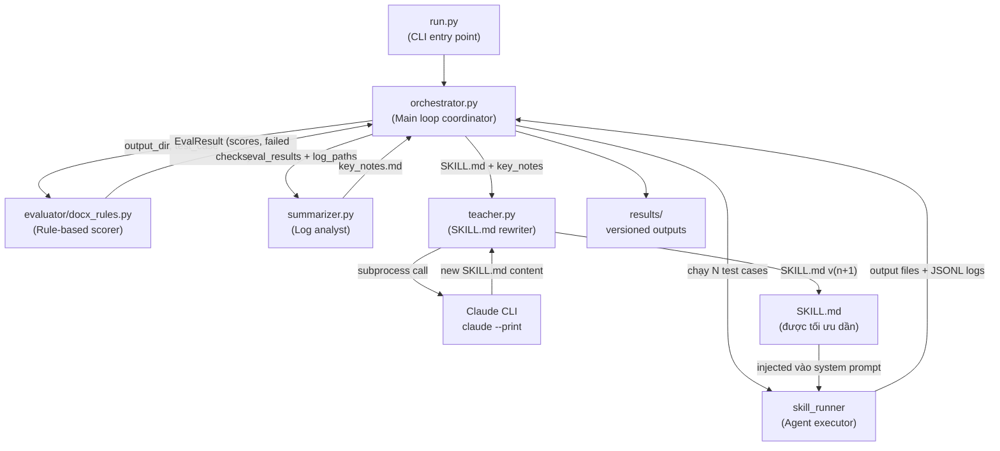
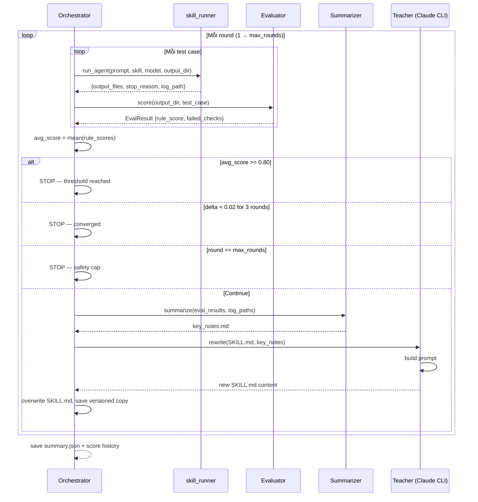

# Skill Distillation Pipeline

Tự động tối ưu hóa file `SKILL.md` để Small Language Model (SLM) thực thi kỹ năng tốt hơn — không cần fine-tuning, không cần GPU.

## Ý tưởng cốt lõi

Thay vì cải thiện model, ta cải thiện **hướng dẫn** (SKILL.md) mà model đọc trước khi làm việc. Một Teacher LLM (Claude) đọc log lỗi của Student SLM (Qwen3-8B) rồi viết lại SKILL.md sao cho Student ít mắc lỗi hơn ở vòng kế tiếp.

```
SKILL.md v0 ──► Student chạy ──► Lỗi A, B, C
                                       │
                              Teacher đọc log
                                       │
SKILL.md v1 ◄── Teacher viết lại ◄────┘

SKILL.md v1 ──► Student chạy ──► Lỗi ít hơn...
```

---

## Kiến trúc hệ thống



---

## Flow chi tiết từng round



---

## Cấu trúc thư mục

```
distillation/
├── run.py                  # CLI entry point — chạy từ đây
├── orchestrator.py         # điều phối toàn bộ loop
├── summarizer.py           # đọc JSONL logs → key_notes text
├── teacher.py              # gọi `claude --print` → SKILL.md mới
├── evaluator/
│   ├── __init__.py
│   ├── base.py             # EvalResult, CheckResult, BaseEvaluator interface
│   └── docx_rules.py       # DocxEvaluator (rule-based cho skill docx)
└── results/                # tự động tạo khi chạy
    └── docx/
        ├── SKILL_round_0.md    # SKILL.md gốc (backup)
        ├── SKILL_round_1.md    # sau round 1
        ├── summary.json        # score history tổng hợp
        └── round_1/
            ├── tc_11/          # output files của từng test case
            │   └── cover_letter.docx
            ├── scores.json     # điểm chi tiết round này
            └── key_notes.md    # error analysis gửi cho Teacher
```

---

## Evaluator — Rule-based checks cho docx

Mỗi output `.docx` được chấm theo 3 nhóm:

```
Group 1 — File validity (weight 30%)
  file_exists       → có file .docx trong output_dir không
  file_parseable    → python-docx mở được, không corrupt
  file_not_empty    → file > 1 KB

Group 2 — Content quality (weight 40%)
  min_paragraphs    → ≥ 3 paragraphs không rỗng
  min_word_count    → ≥ 50 words
  no_placeholders   → không có [INSERT...] hay {{field}} chưa fill

Group 3 — Structure, tự detect từ expected_behavior (weight 30%)
  has_heading       → khi expected chứa "heading", "H1", "tiêu đề"
  has_table         → khi expected chứa "table", "bảng"
  has_list          → khi expected chứa "list", "danh sách", "numbered"
  has_toc           → khi expected chứa "table of contents", "mục lục"
  heading_hierarchy → H1 trước H2, không skip level
```

**Score cuối = weighted average.** Pass/fail ngưỡng: `rule_score ≥ 0.6`.

---

## Stopping criteria

| Điều kiện | Giá trị | Ý nghĩa |
|---|---|---|
| `STOP_THRESHOLD` | 0.80 | avg score ≥ 0.80 → đủ tốt, dừng |
| `CONVERGE_DELTA` | 0.02 | nếu cải thiện < 0.02 liên tiếp K round → hội tụ |
| `CONVERGE_K` | 3 | số round liên tiếp không cải thiện |
| `MAX_ROUNDS` | 10 | hard cap tuyệt đối |

---

## Lệnh chạy

Tất cả lệnh chạy từ trong thư mục `distillation/`.

### Chạy thử không tốn token (dry-run)

```bash
cd distillation/

conda run -n skills python3 run.py \
  --skill docx \
  --rounds 2 \
  --test-cases 3 \
  --dry-run \
  --verbose
```

`--dry-run` chạy toàn bộ pipeline (skill_runner + evaluator + summarizer) nhưng **bỏ qua bước gọi Teacher** — SKILL.md không thay đổi. Dùng để kiểm tra pipeline chạy được trước khi tiêu token thật.

---

### Chạy full pipeline

```bash
conda run -n skills python3 run.py \
  --skill docx \
  --rounds 5 \
  --test-cases 5 \
  --verbose
```

---

### Giải thích từng option

| Option | Default | Mô tả |
|---|---|---|
| `--skill`, `-s` | _(required)_ | Tên skill cần distill. Phải khớp với tên folder trong `skill_runner/skills/` và có file test cases tương ứng trong `skill_evaluation/test_cases/<skill>.json`. |
| `--rounds`, `-r` | `5` | Số round tối đa. Pipeline có thể dừng sớm nếu đạt threshold hoặc hội tụ. |
| `--test-cases`, `-n` | `5` | Số test cases lấy từ đầu file JSON để chạy mỗi round. Tăng lên để kết quả đáng tin cậy hơn, giảm để chạy nhanh hơn khi debug. |
| `--student` | `qwen/qwen3-8b` | OpenRouter model ID cho Student — model cần được tối ưu. |
| `--teacher` | `claude-haiku-4-5` | Claude model ID cho Teacher — model viết lại SKILL.md. |
| `--test-cases-file` | _(auto)_ | Override đường dẫn file JSON test cases. Mặc định tìm tại `../skill_evaluation/test_cases/<skill>.json`. |
| `--results-dir` | `./results` | Thư mục lưu SKILL.md versions và scores. Tự động tạo nếu chưa có. |
| `--skills-dir` | _(auto)_ | Override đường dẫn `skill_runner/skills/`. Mặc định tự detect. |
| `--verbose`, `-v` | off | In tiến trình từng iteration ra terminal. |
| `--dry-run` | off | Chạy eval + summarize, bỏ qua Teacher. SKILL.md không bị thay đổi. |

---

### Ví dụ các tình huống

```bash
# Chạy với model mạnh hơn để làm ceiling reference
conda run -n skills python3 run.py \
  --skill docx \
  --student anthropic/claude-haiku-4-5 \
  --rounds 1 \
  --test-cases 10 \
  --results-dir ./results_ceiling

# Chạy nhiều test cases hơn, nhiều rounds hơn để có kết quả tốt
conda run -n skills python3 run.py \
  --skill docx \
  --rounds 10 \
  --test-cases 10 \
  --verbose

# Dùng file test cases tùy chỉnh
conda run -n skills python3 run.py \
  --skill docx \
  --test-cases-file ./my_custom_cases.json \
  --rounds 3
```

---

## Output sau khi chạy

```
results/docx/
├── SKILL_round_0.md      ← SKILL.md gốc (backup an toàn)
├── SKILL_round_1.md      ← sau khi Teacher viết lại lần 1
├── SKILL_round_2.md      ← ...
├── summary.json          ← score history + best round
│
├── round_1/
│   ├── tc_11/cover_letter.docx   ← output của từng test case
│   ├── tc_12/meeting_minutes.docx
│   ├── scores.json               ← điểm chi tiết từng check
│   └── key_notes.md              ← error analysis gửi Teacher
│
└── round_2/
    └── ...
```

**`summary.json`** — ví dụ:
```json
{
  "skill": "docx",
  "student_model": "qwen/qwen3-8b",
  "rounds_run": 3,
  "final_score": 0.74,
  "best_round": 3,
  "best_score": 0.74,
  "score_history": [
    {"round": 1, "avg_score": 0.51},
    {"round": 2, "avg_score": 0.65},
    {"round": 3, "avg_score": 0.74}
  ]
}
```

---

## Thêm skill mới

Để thêm evaluator cho skill mới (ví dụ `xlsx`):

1. Tạo `evaluator/xlsx_rules.py` với class `XlsxEvaluator` implement method `score()` — xem `docx_rules.py` làm mẫu.
2. Đăng ký trong `orchestrator.py`:
   ```python
   from evaluator.xlsx_rules import XlsxEvaluator
   EVALUATORS = {
       "docx": DocxEvaluator(),
       "xlsx": XlsxEvaluator(),   # thêm vào đây
   }
   ```
3. Chạy: `python run.py --skill xlsx --rounds 5 --test-cases 5`

---

## Yêu cầu

- `claude` CLI đã login (dùng `claude` trong terminal là được)
- `OPENROUTER_API_KEY` trong `skill_runner/.env`
- Conda env `skills` với các thư viện: `python-docx`, `click`, `rich`, `openai`, `python-dotenv`
